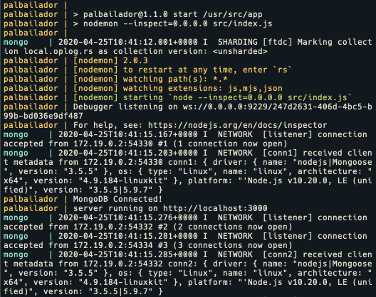
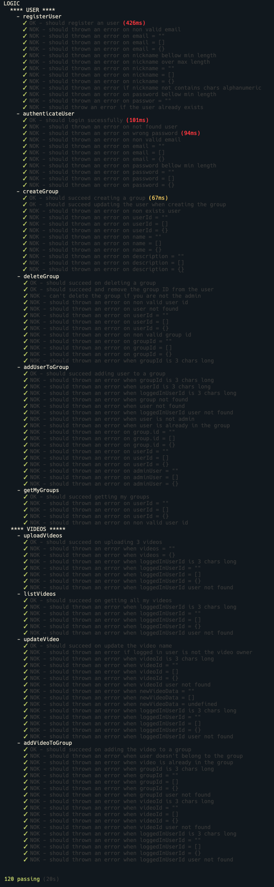

# palBailador

## BACKEND

REST Server API based on express, node and mongoose.
Manage all API calls from the frontend related to users, videos and groups

**Backend Entrypoint: `src/index.js`**

## Endpoints

| ENDPOINT                             | HTTP METHOD |                       |
| ------------------------------------ | ----------- | --------------------- |
| /api/user/new                        | POST        | register user         |
| /api/user/login                      | POST        | authenticates user    |
| /api/video/new                       | POST        | upload videos         |
| /api/video/list                      | GET         | list my videos        |
| /api/video/update/:videoId           | PUT         | update a video        |
| /api/group/new                       | POST        | creates a new group   |
| /api/group/delete/:groupId           | DELETE      | delete a group by ID  |
| /api/group/add-user/:userId/:groupId | POST        | add a user to a group |
| /api/group/my                        | POST        | get my groups         |

**Remember**: the project is using Docker so you'll need to use `http://0.0.0.0:80` as host

## Requirements

For development, you will only need a Node global package and NPM installed in your environment.

- [Install Node](https://nodejs.org/) (download the installer)
- [Install NPM](https://www.npmjs.com/get-npm)

## Install the project

- [Go to the root folder and follow that instructions to install the hole project](#)

## Run the project

To run the backend you will need docker installed in your environment. [Install Docker](https://docs.docker.com/get-docker/).

To start the server run the following command:

- `docker-compose up --build`

If everything goes fine you must see a message like this:

Specially, paid attention to the message `MongoDB Connected!` and `server running on http://localhost:3000` to verify the project was successfully connected.

## Testing

<em>the main backend LOGIC was tested.</em>

## Commits

[Husky](https://github.com/typicode/husky) was configured to required all tests passed before commit. (pre-commit)

## Package.json scripts

- `npm start`: executes the command `nodemon --inspect=0.0.0.0 src/index.js`. Docker is responsible for execute this command after the image is build
- `npm run lint`: executes all lint rules base on [standardJS](https://standardjs.com/)
- `npm run lint:fix`: format all js files with prettier-eslint
- `npm run test`: executes all test based on mocha & chai
- `npm run test:debug`: executes all test based on mocha & chai and stop the chrome inspector on any breakpoints or debugger
- `npm run test:coverage:html`: executes the coverage from nyc (istanbul) for all test and creates the reporter in HTML
- `npm run test:coverage:text`: executes the coverage from nyc (istanbul) for all test and creates the reporter in TEXT
